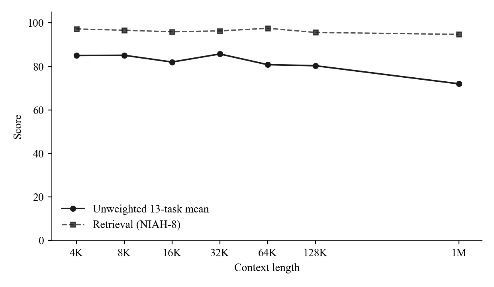
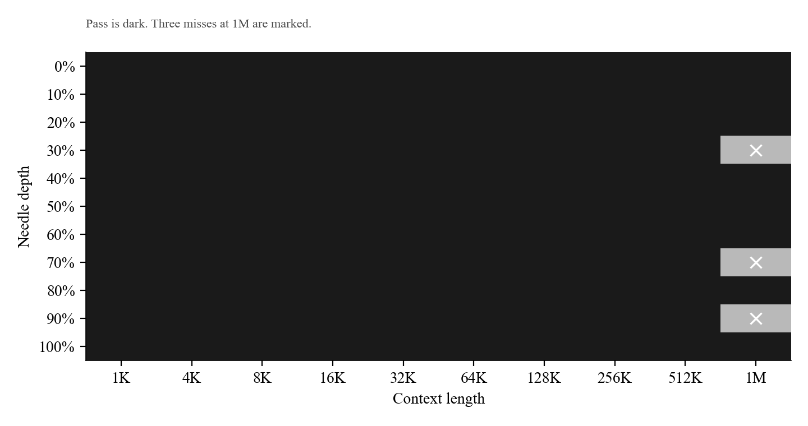
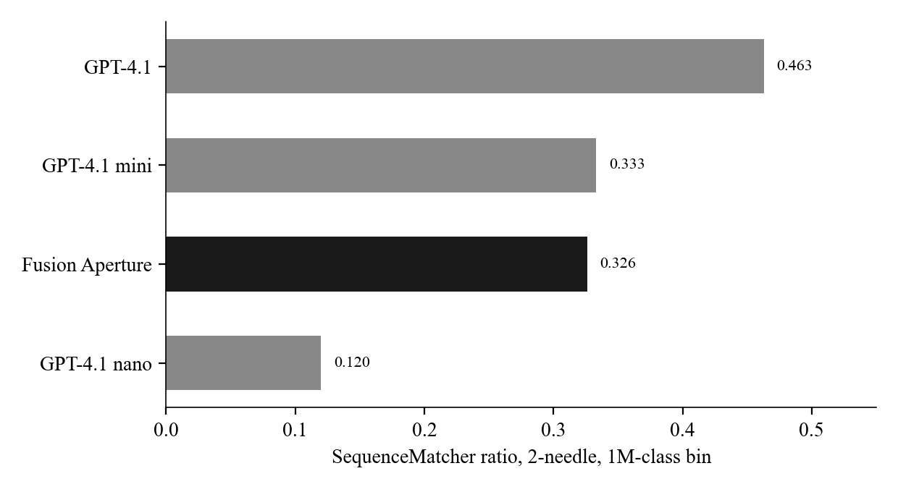
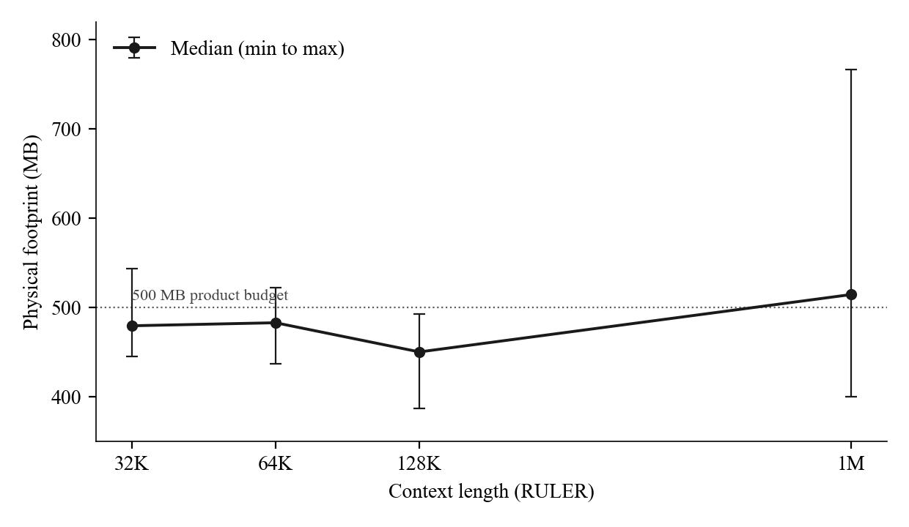

# Fusion Aperture long context evaluation pack

Fusion Aperture · 19 August 2026

This folder documents a locked evaluation of Fusion Aperture. The stack itself is not in this folder.

You can check that the published tables match the hashed score files and that the headline averages recompute from those files. You cannot rebuild generation from what is here, and nothing here is an implementation of the stack.

The measurement paper lives in `paper/`. Everything else exists so a careful reader can audit that paper without being handed the engine.

## Results

Host: frozen **Qwen3.5-2B**, **Q4_K_M**, no extra long-context training. Decode is greedy (NVIDIA RULER defaults). RULER uses n=10 per task per length; null answers are 0/10 at every length. Memory is Darwin `ri_phys_footprint` of the generation process on a Mac. The product surface is iPhone 12 and later, A14 Bionic and later chips and devices; that is not this meter.

**RULER.** Unweighted 13-task mean. NIAH-8 is the eight retrieval tasks.

| ctx | mean | NIAH-8 | vt | cwe | fwe | qa_1 | qa_2 |
|---:|---:|---:|---:|---:|---:|---:|---:|
| 4K | 85.0 | 97.2 | 22 | 85 | 100 | 90 | 30 |
| 8K | 85.1 | 96.6 | 16 | 84 | 93.33 | 80 | 60 |
| 16K | 82.0 | 95.9 | 8 | 90 | 100 | 60 | 40 |
| 32K | 85.7 | 96.3 | 16 | 88 | 100 | 80 | 60 |
| 64K | 80.8 | 97.5 | 4 | 57 | 100 | 60 | 50 |
| 128K | **80.3** | 95.6 | 20 | 39 | 100 | 60 | 60 |
| 1M | **72.0** | **94.7** | 8 | 1 | 100 | 40 | 30 |

**NIAH.** 110-cell Kamradt-style ladder. Not Gemini’s vendor needle, and not RULER NIAH-8.

| | |
|---|---|
| Cells | 110 |
| Passes | 107 |
| Macro | 97.27% |
| 1K–512K | 100% (99/99) |
| 1M | 72.73% (8/11) |

The three misses are at 1M only, depths 33.91%, 66.09%, and 89.57%.

**OpenAI-MRCR.** 2-needle, bin (512K, 1M], n=91. Mean **0.326**.

**Physical memory.** Min / median / max, MB. The samples column is OS polls, not benchmark items. NIAH is omitted (too few polls). A 500 MB product budget is not a measured ceiling.

| sweep | samples | min | median | max |
|---|---:|---:|---:|---:|
| RULER 32K | 839 | 445.5 | 479.5 | 543.3 |
| RULER 64K | 904 | 437.0 | 482.9 | 522.4 |
| RULER 128K | 257 | 387.1 | 450.2 | 492.9 |
| RULER 1M | 827 | 399.9 | 514.5 | 766.6 |
| MRCR 512K–1M | 69 | 482.5 | 520.6 | 520.7 |

Per-task 128K and 1M scores, miss cells, and published cousin scores with URLs are in `paper/` and `comparisons/`. Fusion Aperture achieves state-of-the-art quality–memory efficiency among training-free long-context inference systems at the 2B Q4, mobile, half-gigabyte-class operating point. That sentence is scoped. It is not a claim of the highest RULER mean among trained 30B to 235B models.

## What you can check

The RULER `summary.csv` files and the MRCR summary are byte identical to the artifacts named in Appendix A of the paper. SHA-256 of those files is in `metadata/hashes.sha256`.

`verification/verify_hashes.py` confirms the files on disk still match that list.

`verification/recompute_aggregates.py` reads the NVIDIA summaries, rebuilds the unweighted 13 task mean and the eight task retrieval mean, and checks the NIAH and MRCR headlines. If a table in the paper disagrees with those recomputations, the paper is wrong.

Stock scorers are NVIDIA `evaluate.py` for RULER and OpenAI’s published MRCR grade (hash prefix, then `difflib.SequenceMatcher.ratio`). This pack does not reimplement those graders. It checks that our stored outputs of those graders are internally consistent.

## What you cannot do here

There is no binary, no container, no server, and no recipe that would let you regenerate a million token completion. Prediction jsonl files (prompt, completion, gold) are the item level audit trail for RULER. They are large. They are not in this clone. When we publish a release archive they will be listed in `results/manifests/` with hashes. Until that archive exists, the checkable objects are the summaries, the paper, and the derived tables.

## How the folders are meant to be read

`paper/` is the manuscript. Read it first.

`protocols/` says which public harness we ran and which decode defaults we locked. Those defaults are NVIDIA’s published RULER defaults, not a private recipe.

`results/` holds the score files. RULER lengths are named by token count. NIAH is a public summary of 110 cells, not a copy of a lab sidecar. MRCR is the two needle bin we actually ran.

`measurements/memory.md` is our footprint table. Sample counts there are operating system polls, not benchmark items. NIAH was not densely sampled and is omitted from that table on purpose.

`comparisons/` repeats published scores with URLs, lengths, and sample counts. `comparison_policy.md` is the rule for that folder. Other systems’ memory is not estimated.

`limitations/` names the miss cells and the tasks that pull the 1M mean down. It does not explain the engine.

`metadata/` is host, device, and hashes.

`verification/` is the only code. It audits files. It does not run a model.

## Citation

Please cite the paper, not this folder by itself. See `CITATION.cff`.

Hsieh et al., RULER, arXiv:2404.06654, and the NVIDIA RULER repository are the protocol for the 13 task suite. OpenAI’s GPT-4.1 post and the `openai/mrcr` dataset are the protocol for MRCR. Needle practice follows the Kamradt style grid described in the paper, which is not Gemini’s internal needle test.

## License

Copyright 2026 Fusion Aperture. All rights reserved except as granted in `LICENSE`.

This folder does not contain Fusion Aperture. The stack, binaries, kernels, and unpublished methods are not licensed here. No patent, trademark, or reverse-engineering right is granted for them.

The Evaluation Materials in this folder (manuscript, tables, figures, manifests, hashes, protocol notes, and verification scripts) are licensed under Creative Commons Attribution-NonCommercial-NoDerivatives 4.0 International. SPDX identifier: `CC-BY-NC-ND-4.0`. Cover terms are in `LICENSE`. The canonical legal code is `LICENSES/CC-BY-NC-ND-4.0.txt`.

You may share this archive verbatim for non-commercial purposes, with the attribution that license requires. You may not share a modified pack. You may not use the Evaluation Materials primarily for commercial advantage. “Fusion Aperture” may be used for accurate citation only.

Qwen3.5-2B, NVIDIA RULER, and openai/mrcr remain with their owners. This file does not relicense those works.

If you cite the numbers, cite the paper named in `CITATION.cff`.

## Status

Private evaluation archive. 19 August 2026.
